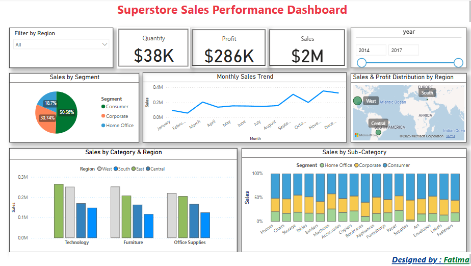

# 📊 Power BI Dashboard – Superstore Sales Analysis

This project presents an interactive Power BI dashboard that analyzes sales performance data from a fictional Superstore. It provides valuable insights into sales trends, profits, regional performance, top categories, and customer segmentation.

---

## 📁 Data Source

The data used in this dashboard comes from an Excel file simulating Superstore sales, including information on:
- Orders
- Products
- Customers
- Regions
- Categories and Sub-Categories

🔗 [Download the dataset](https://github.com/githu122/powerbi-dashboard-superstore/raw/main/SuperstoreData.xlsx)

---

## 📈 Dashboard Features

The dashboard includes:

- 🛒 **Total Sales, Profit, and Quantity** overview (KPI Cards)  
- 🌍 **Sales by Region and State** (Map visualization)  
- 🧱 **Top Categories and Sub-Categories by Sales**  
- 📆 **Monthly Sales Trends** (Line chart)  
- 👤 **Customer Segmentation**  
- 📦 **Product Performance** (Top/Bottom performing products)

Each visualization is interactive and supports cross-filtering.

---

## 💡 Key Insights

- The **West** and **East** regions drive the majority of sales.
- **Technology** is the most profitable category, followed by **Office Supplies**.
- Sales peaked during the **holiday months**, especially **November and December**.
- Certain **sub-categories** like **Chairs** and **Phones** outperform others consistently.
- Some states show high sales but low profit — highlighting potential cost or pricing issues.

---

## ✅ Recommendations

- Focus marketing efforts on **high-profit categories** like Technology.
- Improve profitability in low-margin states through better pricing or cost control.
- Invest in top-performing products and phase out underperforming items.
- Target repeat customers in the East region for loyalty programs.

---

## 🛠️ Tools Used

- **Power BI** – for data modeling, visualizations, and interactive dashboard
- **Excel** – as the primary data source

---

## 👩‍💻 Author

**Fatima** – Aspiring Data Analyst  
📧 Email: fatima190195@gmail.com  
🔗 [Connect on LinkedIn](https://www.linkedin.com/in/fatima-data-scientist-a3202329a/)

---[Uploading Sample - Superstore.csv…]()

## 📜 License

This project is licensed under the [MIT License](./LICENSE).
